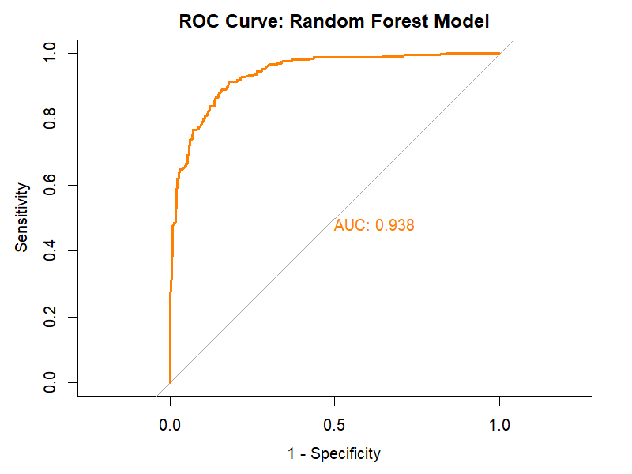
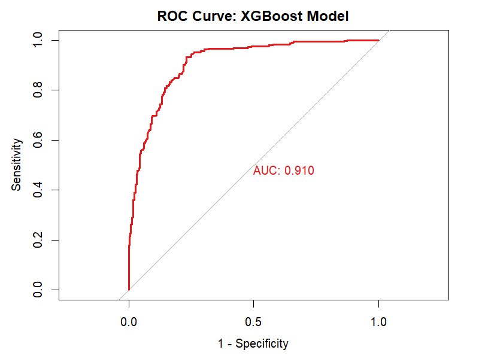
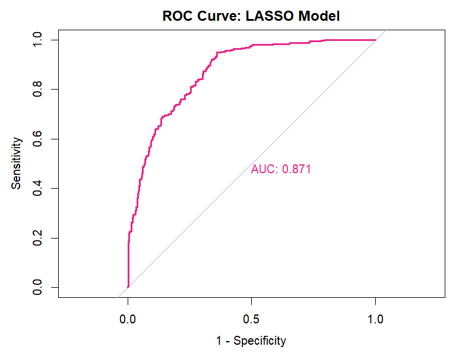
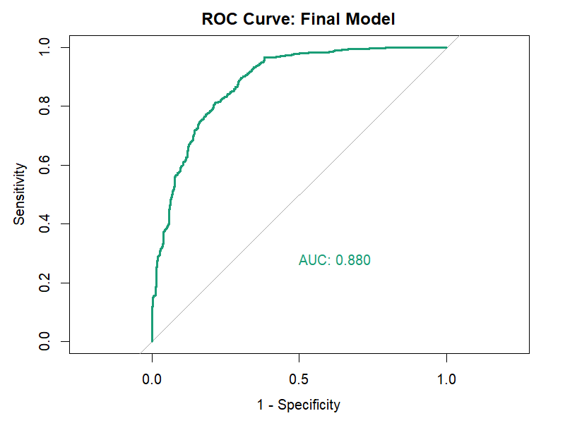
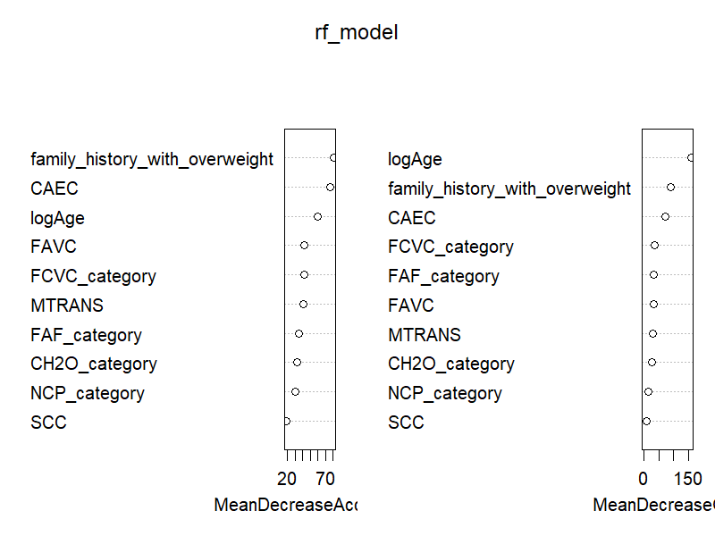
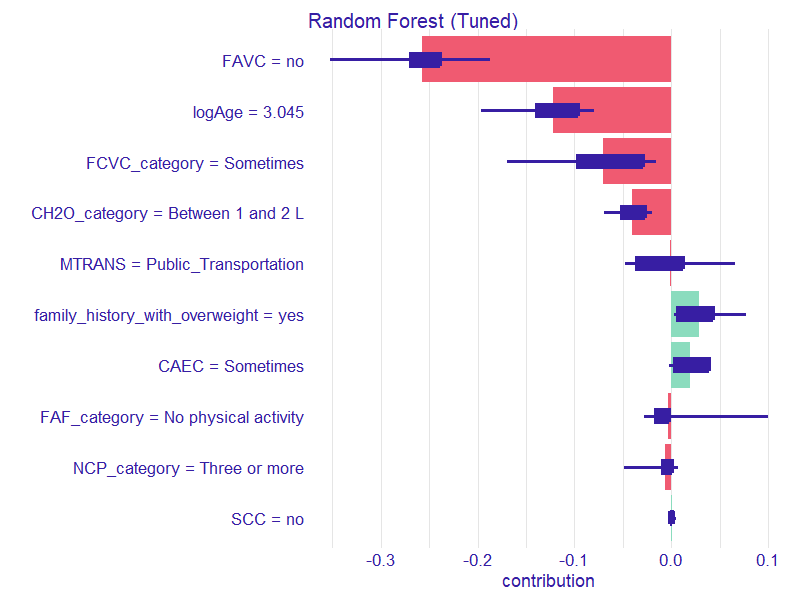
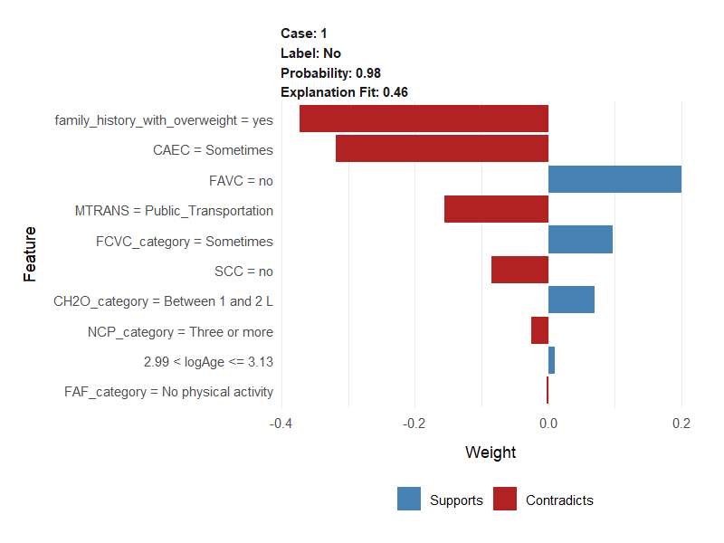

# Obesity Risk Prediction: A Machine Learning & Statistical Analysis


## Executive Summary
This repository contains an end-to-end Data Science and Machine Learning pipeline built in **R**. The primary objective is to predict obesity levels based on eating habits and physical condition data. The project combines traditional statistical modeling (Binomial/Multinomial Logistic Regression) with modern Machine Learning algorithms (Random Forest, XGBoost), ultimately utilizing Explainable AI (XAI) to interpret clinical predictions.

## The Data & Preprocessing
The data stems from "Estimation of obesity levels based on eating habits and physical condition" by Palechor & De la Hoz Manotas, and consists of patient records from Mexico, Peru and Colombia, containing dietary variables (e.g., vegetable consumption, high-calorie food intake) and lifestyle habits (e.g., physical activity, transportation mode).
* **Data Cleaning & Feature Engineering:** Character variables were transformed into factors, sparse categories were collapsed (e.g., CALC, MTRANS, NCP_category), and several questionnaire-based variables (FCVC, NCP, CH2O, FAF, TUE) were rounded back to their nearest valid response category. This step was performed because approximately 77% of the dataset consists of SMOTE-generated synthetic observations, which introduce interpolated decimal values for originally discrete questionnaire responses (e.g., Never, Sometimes, Always).
* **Target Variable:** Formulated as a binary classification problem (`Is_Obese`: Yes/No) and later explored as a multiclass problem (`NObeyesdad`).

## Methodology & Modeling Approach
1. **Statistical Inference:** Developed purposeful backward elimination Binomial and Multinomial Logistic Regression models, incorporating interaction terms (2 interaction terms for the Binomial model, 1 interaction term for the Multinomial model). Multicollinearity was assessed using Variance Inflation Factors (VIF). Because car::vif() does not directly support the final GLM and multinomial specifications with interactions, VIFs were computed from auxiliary linear models containing the identical predictor design matrix.
   * Estimates for Obesity Type III (and partly Obesity Type II) remain unstable due to near-complete separation caused by the high homogeneity of these classes across multiple predictors, even after attempting bias-reduced estimation.
2. **Feature Selection:** Applied **LASSO Regression** (`glmnet`) with 10-Fold Cross-Validation to identify the most critical predictors.
3. **Machine Learning:** 
   * Trained a **Random Forest** model with Hyperparameter Tuning (via grid search for `mtry`).
   * Established an optimal clinical decision threshold using **Youden's Index** (Cutoff at 55.8%).
   * Hand-coded a native **XGBoost** model (`xgb.DMatrix`, `xgb.cv`) with early stopping for rigorous benchmarking.
   * The logistic regression models were developed for statistical inference using the full dataset, whereas predictive machine learning models (LASSO, Random Forest and XGBoost) were evaluated using a stratified train/test split.

## Key Results
* **Random Forest (Tuned):** Achieved an impressive **AUC of 0.938**.
* **XGBoost:** Reached an **AUC of 0.910**. 
* In this specific tabular dataset, the Random Forest model exhibited superior stability and predictive power, outperforming the Gradient Boosting approach.

### ROC Curves & Model Performance
Below are the ROC curves for the main models developed in this pipeline:

<p align="center">
  
   
</p>
<p align="center">
  
  
</p>

### Global Feature Importance
The mean decrease in accuracy metric from the Random Forest model highlights the most critical predictors across the entire dataset:

<p align="center">
  
</p>

## Explainable AI (XAI)
To break the "black box" nature of the Random Forest model, **DALEX (SHAP values)** and **LIME** were implemented. By analyzing individual predictions (e.g., Patient No.1), the models successfully translated mathematical probabilities into tangible clinical insights (e.g., identifying the absence of high-calorie foods as the strongest protective factor). Both methods agree on the direction of each variable's effect, but not fully on its magnitude.

### Local Explanations (Patient No. 1)

**SHAP Values (DALEX):**
<p align="center">
  
</p>

**LIME Explanation:**
<p align="center">
  
</p>

## Reproducibility & Setup
This project uses `renv` to ensure strict dependency management and absolute reproducibility. 

To run this project locally, clone the repository, open the `.Rproj` file in RStudio, and run the following commands in your R console:

```r
# Install renv if you don't have it
install.packages("renv")

# Restore the exact package environment used in this project
renv::restore()
```

The project structure assumes the following directories:

```text
data/
output/
```